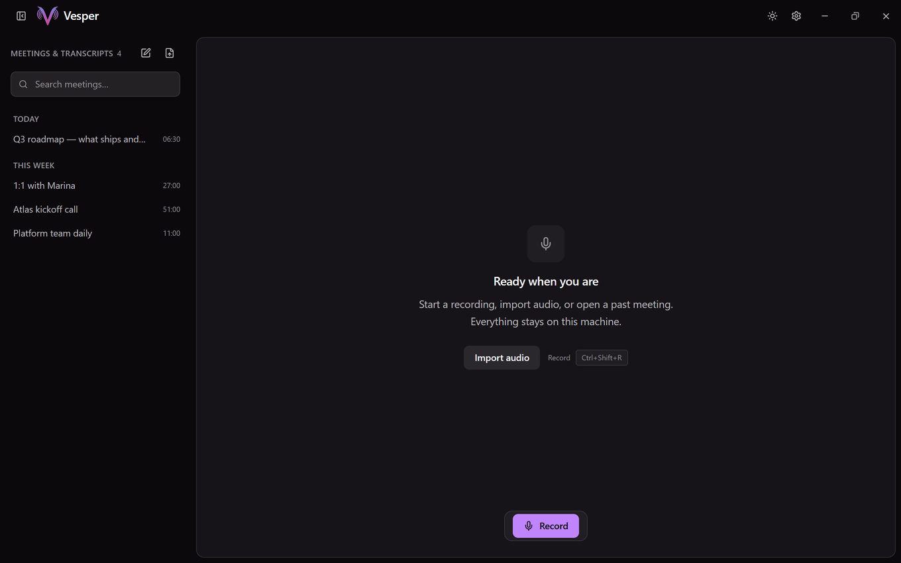
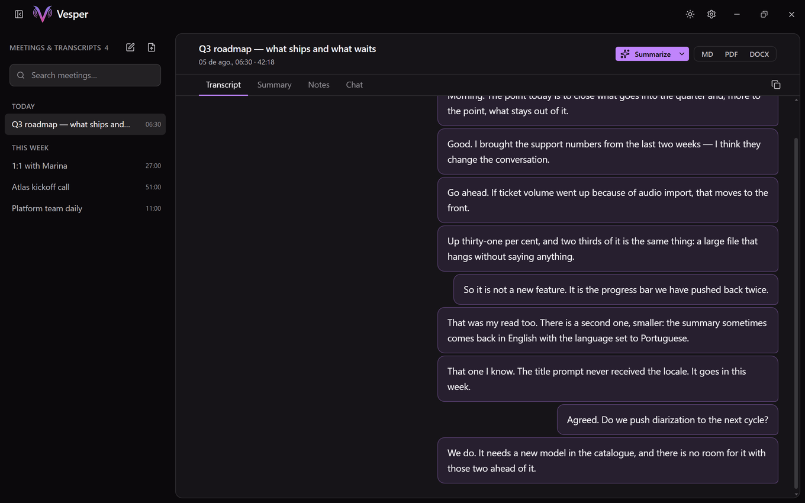
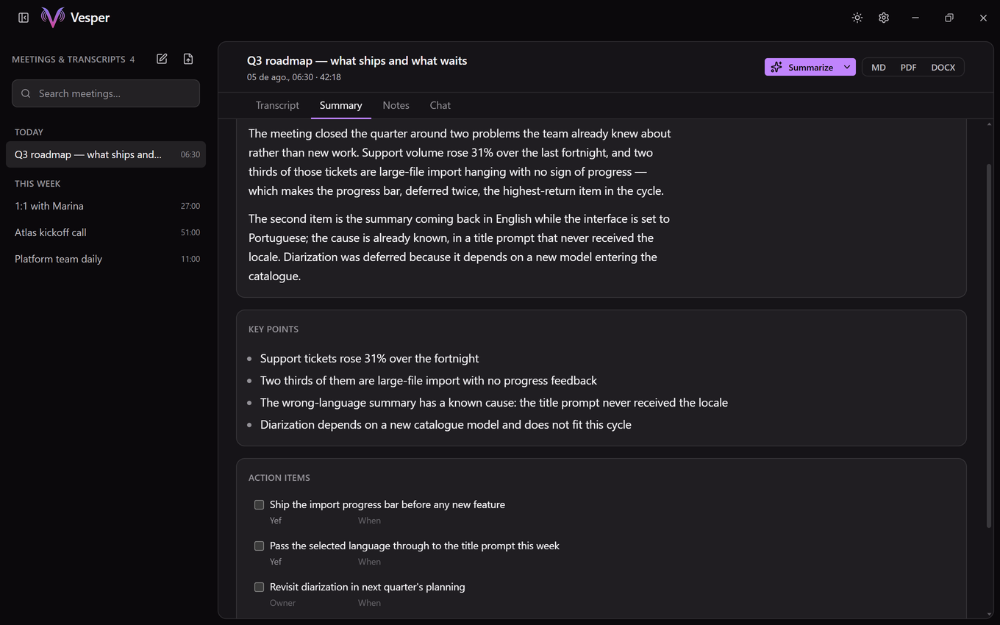
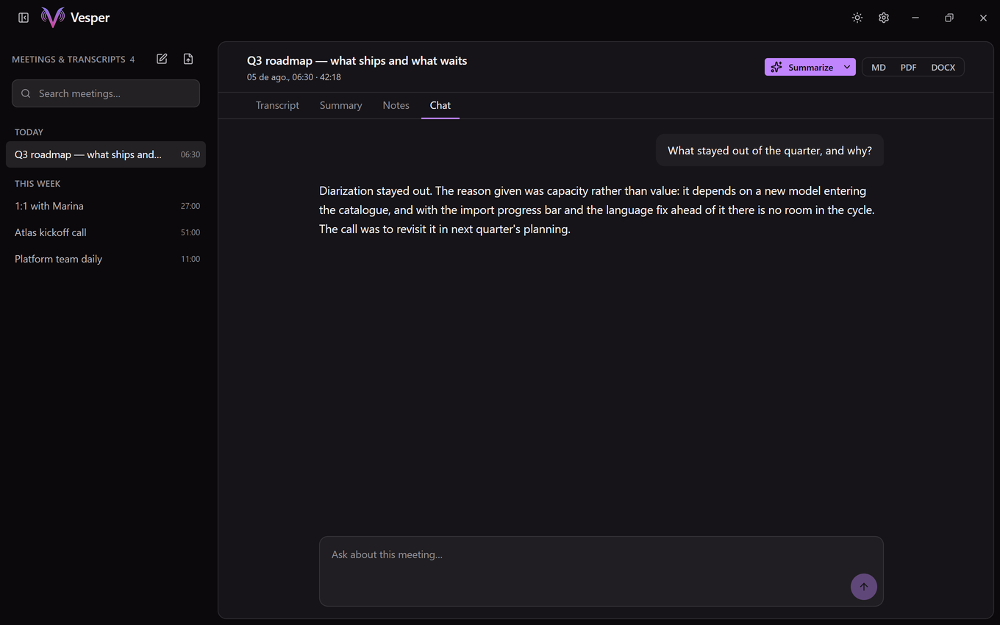

# Vesper

Desktop meeting notes that stay on your machine. Vesper records **microphone and system audio as two separate channels**, transcribes them live, and writes a summary — with no account, no telemetry, and nothing sent anywhere unless you ask for it.

No bot joins your call. Nothing is uploaded to be processed. The transcript, the summary and the audio are files on your disk.



<table>
<tr>
<td width="50%"></td>
<td width="50%"></td>
</tr>
<tr>
<td colspan="2" align="center"><em>Left: the transcript, cut at pauses rather than on a clock. Right: the summary the local model wrote from it.</em></td>
</tr>
</table>



## Features

- Record, pause, resume, stop — with a floating card that stays on top while you work in another window
- Dual-channel capture: microphone is **Me**, system audio is **Others**
- Live transcript, cut at pauses rather than on a clock, so a bubble is a sentence
- Import an audio file, or retranscribe one you already have
- Summary templates, action items, key points, and a chat over the meeting
- Notes you type during the meeting, folded into a corner until you need them
- Search across every meeting; export to Markdown, PDF or DOCX
- System tray, a global hotkey you can change, and update checks
- Quiet-room guard: three minutes without speech asks whether you are still there, five more without an answer stops the recording

## What leaves the machine

Vesper contacts exactly three hosts, and never on its own initiative:

| Host | When | What it carries |
|---|---|---|
| `github.com` | Update check | The installed version. No meeting data. |
| `huggingface.co` | You download a model in Settings | Nothing but the request for the file, which is verified against a checksum before it is loaded. |
| `openrouter.ai` | Only if **you** select OpenRouter as the provider | Audio for transcription, or transcript text for summaries — the thing you chose to send. |

There is no fourth host. No analytics, no crash reporting, no "anonymous usage statistics".

**Offline mode** turns all three off at once. "Cloud optional" is only a promise if it can be enforced, and this is the enforcement: with the switch on, every path that would reach the network is refused before it opens a socket, and each refusal names the thing that did not happen rather than reporting a connection error the user would go looking for.

**Local by default.** Out of the box, transcription runs on whisper.cpp and summaries on llama.cpp, both on your machine. OpenRouter is a choice you make in Settings, never a fallback the app takes by itself.

**Your own server.** You can point Vesper at an OpenAI-compatible server you run — Ollama, LM Studio, vLLM, an internal proxy. The address is checked: loopback and private network ranges are accepted, anything routable on the public internet is refused. A model on a public VPS will not work, and that is deliberate for a product that makes this promise.

**API keys** go to the operating system's keychain — Credential Manager on Windows, Keychain on macOS, the Secret Service on Linux. When the keychain refuses (a headless Linux box with no keyring daemon, most often), the app says so and keeps the key in the local database instead, rather than silently losing it.

## Platforms, and what is actually tested

Installers are produced for **Windows**, **macOS** and **Linux**. They are not equally exercised, and pretending otherwise would be dishonest:

| Platform | Built | Tests run in CI | Used and tested by hand |
|---|---|---|---|
| Windows | Yes, with Vulkan | Yes | **Yes — this is the development machine** |
| Linux | Yes, with Vulkan | Yes | No |
| macOS | Yes, CPU only | **No CI job at all** | No |

Day-to-day use, and every manual check of the interface, happens on Windows 11. CI compiles the project and runs the Rust test suite on Linux and Windows, so a Linux build that fails to compile or breaks a test is caught — but nobody has watched the app record a meeting there. macOS is built by the release workflow and is otherwise unverified: it has no CI job, and the Apple bundle has never been launched by the maintainer.

Bug reports from macOS and Linux are genuinely useful, and are the fastest way for that to change.

## GPU acceleration

Optional, off by default, and a **build-time** choice — `--features gpu-vulkan`. The Vulkan SDK is needed to compile it and never to run it: `vulkan-1` ships with every GPU driver, so an installed build asks the user for nothing. Without it, everything runs on the CPU, slower and identically.

## Stack

- **Desktop**: Tauri 2 + Rust
- **UI**: React 19, Vite, TypeScript, Tailwind CSS 4, Framer Motion
- **Speech**: whisper.cpp via `whisper-rs`
- **Language models**: llama.cpp via `llama-cpp-2`
- **Data**: SQLite (`rusqlite`), and audio files next to it

## Develop

Prerequisites: [Node.js](https://nodejs.org/) 20+ (CI builds on 22), [Rust](https://rustup.rs/), and the platform WebView dependencies ([Tauri prerequisites](https://v2.tauri.app/start/prerequisites/)).

On Debian or Ubuntu, audio capture and the native build need five packages that are **not** on Tauri's prerequisites page — CI installs exactly these:

```bash
sudo apt-get install -y libasound2-dev libpipewire-0.3-dev libclang-dev cmake pkg-config
```

**Native ML build** (whisper.cpp + llama.cpp) needs [LLVM](https://github.com/llvm/llvm-project/releases) for `libclang`. On Windows the build script also wants LLVM's `nm` and `objcopy`, which means the whole directory on `PATH` rather than one variable per tool — it asks for the next tool only after finding the previous one:

```powershell
winget install -e --id LLVM.LLVM
$env:LIBCLANG_PATH = "C:\Program Files\LLVM\bin"
$env:Path = "C:\Program Files\LLVM\bin;" + $env:Path
```

```bash
npm install
npm run tauri dev
```

Whisper and GGUF weights are downloaded from **Settings**, from a fixed internal catalogue — the front end cannot ask for an arbitrary URL — and every file is checked against a known hash before it is loaded. Until a model is installed the local engines have nothing to run: there is no fake transcription to fill the gap.

### Useful commands

```bash
npm run typecheck              # tsc --noEmit
npm run build                  # typecheck + production UI build
cd src-tauri && cargo test     # Rust unit tests
npm run tauri build            # desktop package
```

Building with Vulkan on Windows needs the Ninja generator and a short target directory — the nested `vulkan-shaders-gen` project trips MSBuild's parallel scheduling, and its path outgrows the 260-character limit that `tracker.exe` still enforces:

```bash
CMAKE_GENERATOR=Ninja CARGO_TARGET_DIR=/c/vt cargo build --features gpu-vulkan
```

## Branches

| Branch | Role |
|--------|------|
| `dev`  | Integration — feature PRs land here |
| `main` | Release — tagged installers and auto-update artifacts |

## Auto-update

Release builds check `https://github.com/Yefclub/Vesper/releases/latest/download/latest.json`. The signing public key lives in `src-tauri/tauri.conf.json` under `plugins.updater`.

## License

MIT — see [LICENSE](./LICENSE).
